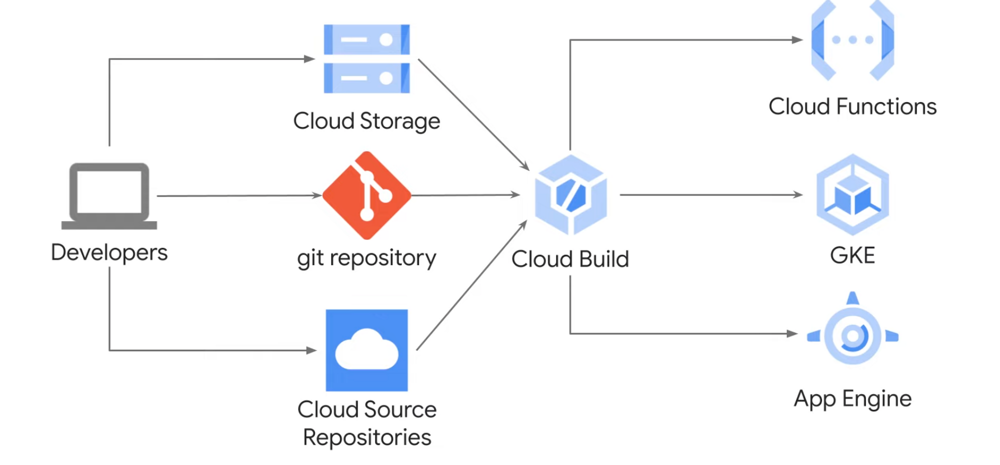
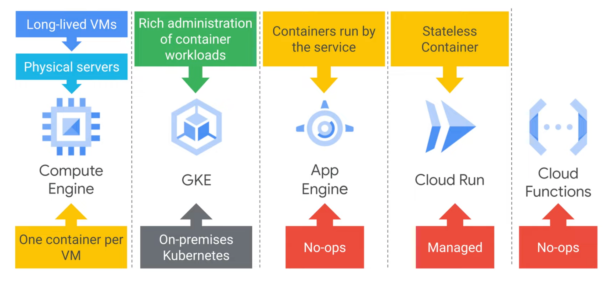

## 컨테이너 소개
---
- `하이퍼바이저` : 기본 하드웨어의 운영체제 종속을 타파하고 여러 가상 머신이 하드웨어를 공유할 수 있게 해주는 소프트웨어 레이어
- VM에는 하이퍼바이저가 있어 많은 애플리케이션을 올릴 수 있지만, 부팅할때 시간이 지연되는 등의 단점이 있음
    - 단일 VM안에서 여러 애플리케이션이 존재한다면 애플리케이션들이 서로 격리되지 않고, 이는 리소스 불균형이 이루어지게 된다.
    - 새로운 문제를 야기할 수 있음
    - 또한 커널도 중복되어 느림
- 위의 문제를 해결하기 위해서는 사용자 공간만 가상화하면 된다.
    - 사용자 공간 : 커널위의 모든 공간
    - → 이것이 바로 컨테이너
- 컨테이너가 가벼운 이유는 운영체제를 포함하지 않기 때문
    - VM 전체를 재가동하거나 운영체제를 새로 시작안해도 됨.
- 컨테이너를 사용하면 애플리케이션 런타임, 시스템 도구, 시스템 라이브러리, 설정과 같은 소프트웨어 종속 항목에 대한 걱정 없이 최종 코드를 VM에서 실행할 수 있다.

### 컨테이너와 컨테이너 이미지

- 컨테이너는 이미지를 실행 중인 인스턴스
- Google Cloud Build를 사용해서 Docker 형식의 컨테이너 이미지를 만들어볼 것임.
- 컨테이너는 Linux에 내장된 기본적인 기능이 아님
    - **컨테이너는 `Linux 네임 스페이스`를 사용하여 애플리케이션이 볼 수 있는 프로세스 ID 번호, 디렉터리 트리, IP 주소 등을 제어**한다.
        - Linux 네임스페이스는 k8s 네임스페이스와 차이가 있다.
    - **컨테이너는 `Linux cgroups`를 사용하여 애플리케이션이 사용할 수 있는 CPU 시간, 메모리, I/O 대역폭, 기타 리소스의 최대 사용량을 제어**한다.
    - **컨테이너는 `Union file systems`를 사용하여 애플리케이션과 해당 종속 항목을 깔끔하게 최소한의 레이어 세트로 효율적으로 캡슐화**한다.
    
- 레이어에서 컨테이너의 구조
    
    
    
    - 이미지를 빌드하는 도구는 `Container manifest`라는 파일의 명령을 읽는다.
    - Docker 형식 컨테이너 이미지의 경우 이를 `Dockerfile`이라고 부른다.
        
        

        
        - Dockerfile의 각 명령어에는 컨테이너 이미지 내부의 레이어가 명시되어 있다.
        - `From 문`은 공개 저장소에서 가져온 기본 레이어 생성으로 시작 (ex. Ubuntu Linux 런타임 환경)
        - `COPY` 명령어는 빌드 도구의 현재 디렉터리에서 복사된 일부 파일을 포함하는 새 레이어를 추가한다.
        - `RUN` 명령어는 make 명령어를 사용하여 애플리케이션을 빌드하고 빌드 결과를 세 번째 레이어에 삽입한다.
        - 끝으로 마지막 레이어는 컨테이너가 실행될 때 컨테이너 내에서 실행할 명령어를 지정한다.
        - Docker 파일을 사용할 땐, 레이어의 변경 가능성이 작은 것부터 큰 것 순으로 구성해야 한다.
        - 이미지에서 새 컨테이너를 실행하면 컨테이너 런타임은 기본 레이어 상단에 쓰기 가능한 새 레이어를 추가한다. 이는 `컨테이너 레이어`라고 불림
            - 컨테이너 레이어는 임시적이라서 컨테이너가 삭제되면 쓰기가능한 레이어의 콘텐츠가 영원히 사라진다.
            
            → 데이터를 영구적으로 저장하고 싶은 경우, 실행 중인 컨테이너 이미지가 아닌 다른 곳에 저장해야 한다.
            
    

### Cloud Build

- 다양한 스토리지 위치에서 빌드에 필요한 소스 코드를 가져올 수 있다.
- cloud build의 각 빌드 단계는 Docker 컨테이너에서 실행된다.

 
 

## 쿠버네티스 소개

---

- 컨테이너에서 실행되고 있는 애플리케이션은 네트워크를 통해 통신해야 하지만, 컨테이너가 서로 찾을 수 있게 해주는 네트워크 패브릭이 없다.
- 컨테이너 인프라를 조정하고 관리할 수 있게 도와주는 쿠버네티스!

### 쿠버네티스란?

- Open source
- Automation
- PaaS 솔루션
- Container management
- 선언적인 구성
    - 배포된 시스템이 원하는 상태와 같도록!
    - 바람직한 상태는 항상 문서화된
- 명령어를 실행해 시스템 상태 변경 가능

### 쿠버네티스 특징

1. 다양한 워크로드 유형을 지원
2. Autoscaling
3. 리소스 제어 가능
4. 생태계 확장
5. 워크로드 이식성 → 어디든지 쿠버네티스를 배포할 수 있다.

 
 

## GKE (Google Kubernetes Engine) 소개

---

- 쿠버네티스는 강력하지만 커다란 인프라를 관리하기 힘들다 → GKE 등장!
- GCP에서 컨테이너화된 애플리케이션을 위한 k8s 환경을 배포, 관리 및 확장할 수 있도록 도와준다.
- 완전 관리형
- 컨테이너에 최적화된 운영체제를 사용 → 요 운영체제는 Google이 관리
- 클러스터가 자동 업그레이드
- 자동 복구 기능 → 노드를 항상 확인
- 클러스터 자체의 확장을 지원
- Cloug build와 container registry와 통합됨
- IAM과 통합해 계정 및 역할 권한을 사용하여 액세스 제어
- Stackdriver는 서비스, 컨테이너, 애플리케이션 및 인프라의 모니터링과 관리를 위한 시스템 → 이를 통합하여 애플리케이션 성능을 확인할 수 있음
- GCP 네트워킹 기능과 호환됨
- 클러스터의 리소스를 보고, 검사하고, 삭제 가능

 
 

## Computing Options

---

### Compute Engine

- GCP에서 실행되는 가상 머신을 제공
- 사전 정의된 VM 구성을 선택할 수 있다.

### App Engine

- 완전 관리형 애플리케이션 플랫폼
- 서버를 관리하고 배포를 구성할 필요가 없음
- 단순히 고드만 사용하면 App Engine이 알아서 인프라를 구성
- 컨테이너 워크로드로 사용할 수 있음
- 소스 코드 분석 및 디버깅 가능 (Stackdriver)
- 버전 제어 및 트래픽 분할

### Google Kubernetes Engine

- k8s 플랫폼을 완전 관리
- 다른 GCP 서비스와 자동 통합하여 k8s 관리

### Cloud Run

- 관리형 컴퓨팅 플랫폼
- 스테이트리스 컨테이너를 배포할 수 있음 (요청이나 이벤트 기반)
- 자체 GKE에서 실행 가능
- 인프라 관리가 전혀 필요 없음 → 코드 작성에만 집중
- 자동 확장/ 축소
- 사용한 리소스에 대해서만 비용을 청구

### Cloud Functions

- 이벤트와 연결된 단일 용도의 단순 함수를 위한 이벤트 기반 서버리스 컴퓨팅 서비스
- 고가용성과 내결함성 설계가 특징

 
 

## Summary

---

1. Create a container using `Cloud Build`.
2. Store a container in `Container Registry`
3. Compare and contrast Kubernetes and Google Kubernetes Engine features.